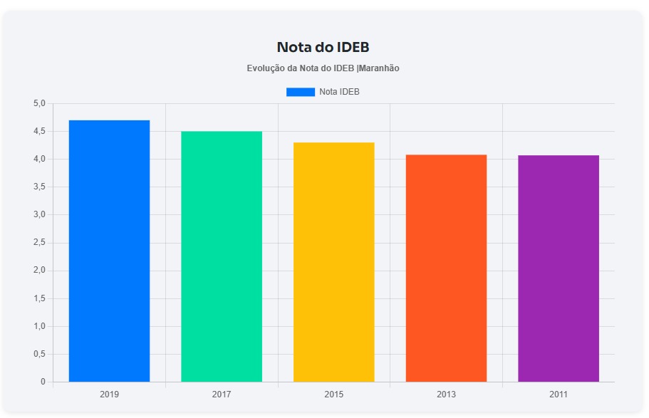

# 📊 Infraestrutura Escolar no Maranhão (Ensino Médio - Rede Estadual)

Aplicação web que consome a **API pública do QEdu** para exibir dados do **Censo Escolar**, com foco na infraestrutura das escolas, exibir as **Notas do ENEM do Ensino Médio da rede estadual** e a **Nota do IDEB**.

---

## ✨ Funcionalidades

- Acesso à API QEdu com autenticação por token
- Exibição de dados de infraestrutura escolar:
  - Quadra de esportes
  - Laboratório de informática
  - Laboratório de ciências
  - Biblioteca
- Visualização das notas do ENEM:
  - Linguagens
  - Matemática
  - Ciências Humanas
  - Ciências da Natureza
  - Redação
- Evolução da nota do IDEB por ano
- Visualização interativa com **gráficos (Chart.js)**
- Requisições assíncronas com **Axios**

---

## 🖥️ Tecnologias utilizadas

- HTML5  
- CSS3  
- JavaScript (ES6+)  
- [Axios](https://axios-http.com/) para requisições HTTP  
- [Chart.js](https://www.chartjs.org/) para visualização de dados  

---

## 🚀 Como rodar o projeto

1. Clone este repositório:

```bash
git clone https://github.com/Nadson-Cutrim/Test-Page.git
cd Test-Page
```

2. Crie uma conta e gere um token de acesso na plataforma do QEdu:

🔗 [QEdu API](https://qedu.org.br/)

3. No arquivo `index.html`, substitua seu token da API:

```js
const token = 'SEU_TOKEN_AQUI'; // Substitua com seu token da API QEdu
```

4. Abra o arquivo `index.html` no seu navegador.

> 💡 Dica: Use a extensão **Live Server** do VSCode para uma melhor experiência de desenvolvimento.

---

## 🧪 Dados exibidos

- Quantidade de escolas com estruturas físicas (quadra, laboratórios, biblioteca)
- Notas médias do ENEM por área
- Indicadores IDEB por município e por ano

---

## 📌 Fonte de Dados

- [QEdu API](https://qedu.org.br/) — Plataforma com dados educacionais públicos

---

## 📸 Screenshot



---

## 📝 Licença

Projeto com fins educacionais e demonstrativos. Sinta-se livre para modificar e reutilizar conforme necessário.

---

Desenvolvido com 💻 pela **Equipe 24 - TRILHAS** 🎈
